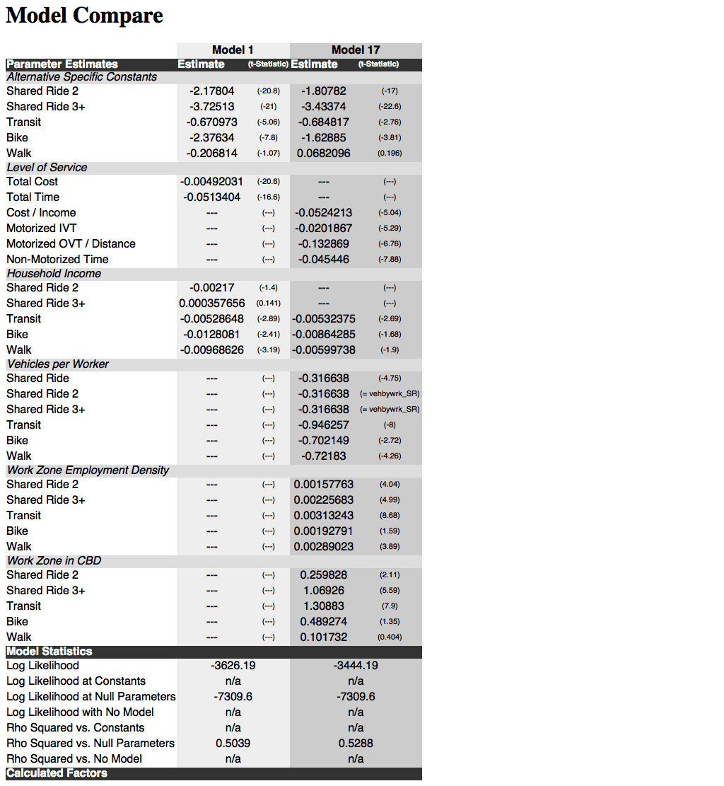

.. currentmodule:: larch.report

.. default-domain:: py

.. testsetup:: *

   import larch
   import os

=========================================================
Reporting Multiple Models in a Single Consolidated Report
=========================================================

Larch includes a facility to report multiple models side-by-side
in a single consolidated report.

.. autofunction:: multireport

To make the consolidated report reasonably legible, we will
organize the parameters into :class:`Category` groups, and used the
:class:`Rename` facility to make sure that the parameter names
(which might sometimes vary from model to model, even when they
apply in the same manner) line up correctly.

.. testcode::

	from larch.report import multireport, Category, Rename

	cat_ASC = Category("Alternative Specific Constants", 
		Rename('Shared Ride 2',  'ASC_SR2' ,           ),
		Rename('Shared Ride 3+', 'ASC_SR3+', 'ASC_SR3P'),
		Rename('Transit',        'ASC_TRAN', 'ASC_Tran'),
		Rename('Bike',           'ASC_BIKE', 'ASC_Bike'),
		Rename('Walk',           'ASC_WALK', 'ASC_Walk'),
	)

	cat_LOS = Category("Level of Service", 
		Rename('Total Cost',              'totcost'),
		Rename('Total Time',              'tottime'),
		Rename('Cost / Income',           'costbyincome'),
		Rename('Motorized IVT',           'motorized_time'),
		Rename('Motorized OVT / Distance','motorized_ovtbydist'),
		Rename('Non-Motorized Time',      'nonmotorized_time'),
	)

	cat_HHIncome = Category("Household Income", 
		Rename('Drive Alone',    'hhinc#1',),
		Rename('Shared Ride 2',  'hhinc#2',),
		Rename('Shared Ride 3+', 'hhinc#3',),
		Rename('Transit',        'hhinc#4',),
		Rename('Bike',           'hhinc#5',),
		Rename('Walk',           'hhinc#6',),
	)

	cat_VehPerWork = Category("Vehicles per Worker", 
		Rename('Drive Alone',    'vehbywrk_DA'  ,                ),
		Rename('Shared Ride',    'vehbywrk_SR'  ,                ),
		Rename('Shared Ride 2',  'vehbywrk_SR2' ,                ),
		Rename('Shared Ride 3+', 'vehbywrk_SR3+',                ),
		Rename('Transit',        'vehbywrk_TRAN', 'vehbywrk_Tran'),
		Rename('Bike',           'vehbywrk_BIKE', 'vehbywrk_Bike'),
		Rename('Walk',           'vehbywrk_WALK', 'vehbywrk_Walk'),
	)

	cat_EmpDen = Category("Work Zone Employment Density", 
		Rename('Drive Alone',    'wkempden_DA'  ,                ),
		Rename('Shared Ride 2',  'wkempden_SR2' ,                ),
		Rename('Shared Ride 3+', 'wkempden_SR3+',                ),
		Rename('Transit',        'wkempden_TRAN', 'wkempden_Tran'),
		Rename('Bike',           'wkempden_BIKE', 'wkempden_Bike'),
		Rename('Walk',           'wkempden_WALK', 'wkempden_Walk'),
	)

	cat_CBD = Category("Work Zone in CBD", 
		Rename('Drive Alone',    'wkcbd_DA'  ,             ),
		Rename('Shared Ride 2',  'wkcbd_SR2' ,             ),
		Rename('Shared Ride 3+', 'wkcbd_SR3+', 'wkcbd_SR3P'),
		Rename('Transit',        'wkcbd_TRAN', 'wkcbd_Tran'),
		Rename('Bike',           'wkcbd_BIKE', 'wkcbd_Bike'),
		Rename('Walk',           'wkcbd_WALK', 'wkcbd_Walk'),
	)

Having defined all out categories, we can organize them into a single list:

.. testcode::

	cat = [
		cat_ASC,
		cat_LOS, 
		cat_HHIncome,
		cat_VehPerWork,
		cat_EmpDen,
		cat_CBD,
	]

Then it's just a matter of loading in our models that we will report, and
generating the multireport.

.. testcode::

	m1 = larch.Model.Example(1)
	m1.maximize_loglike()
	m2 = larch.Model.Example(17)
	m2.maximize_loglike()
	m1.title = "Model 1"
	m2.title = "Model 17"
	htmlreport = multireport([m1,m2], params=cat, ratios=(), title="Model Compare")

Save `htmlreport` to a file and you can open it in your favorite browser:

.. tip::

	If you want access to the report in this example without worrying about assembling all the code blocks
	together on your own, you can load the HTML report as a string like this::

		htmlreport = larch.examples.reproduce(801,'htmlreport')

