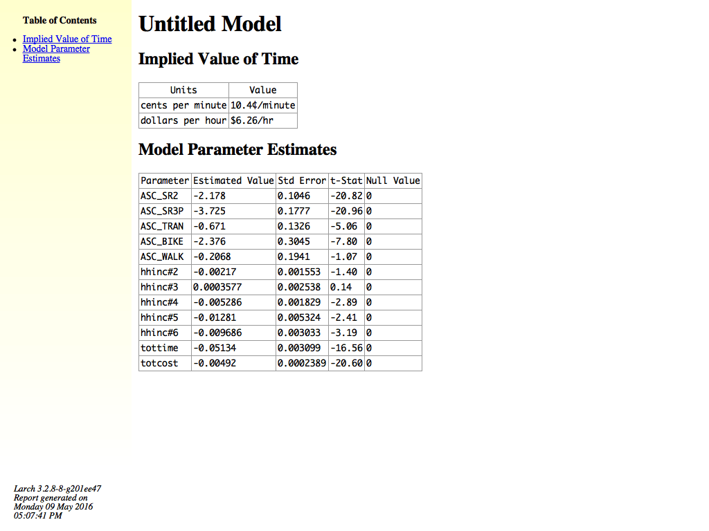
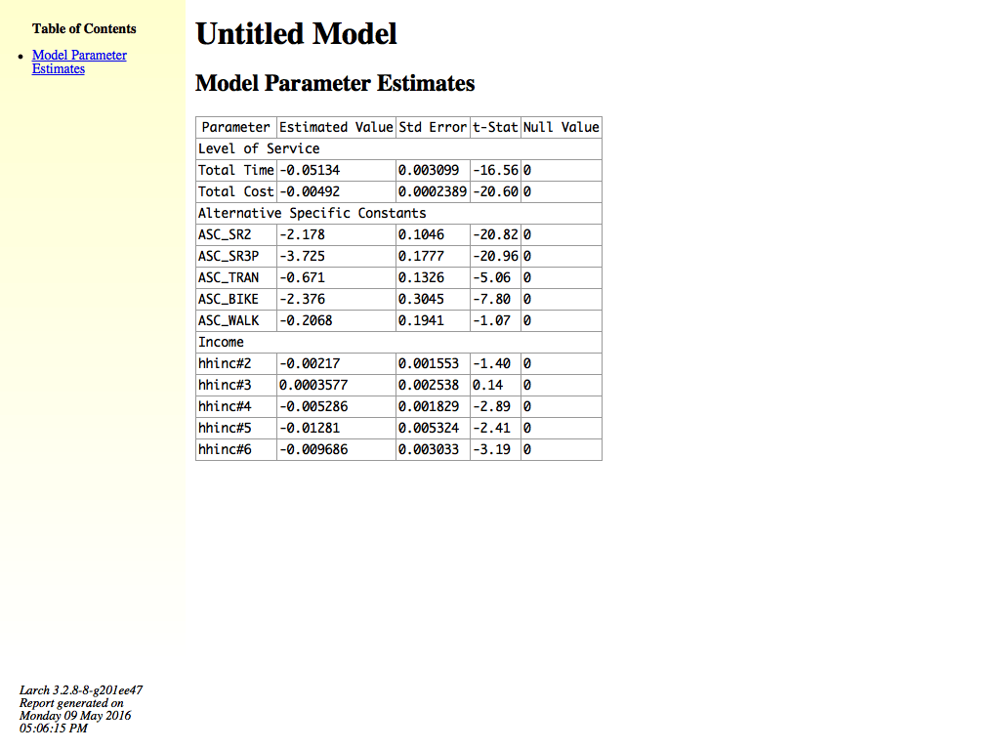

.. currentmodule:: larch

.. default-domain:: py

.. testsetup:: *

   import larch
   import os

=======================
Reporting
=======================

.. automethod:: Model.report

Text Format
~~~~~~~~~~~

.. automethod:: Model.txt_report

XHTML Format
~~~~~~~~~~~~

You can either use the pre-made :meth:`Model.xhtml_report` to generate a
report on a model, or you can roll your own using a combination of
xhtml_* components and custom elements.  For example, you might make a
custom table to hold some facts about your model or data (this example is
very simple, but you could make it more complex and pull information
programatically instead of using fixed strings):

.. doctest::
	:options: +ELLIPSIS, +NORMALIZE_WHITESPACE

	>>> from larch.util.xhtml import XML_Builder
	>>> def report_fileinfo():
	...		x = XML_Builder("div", {'class':"file_info"})
	...		x.h2("File Info", anchor=1)
	...		with x.block("table"):
	...			with x.block("tr"):
	...				x.td("Information 1")
	...				x.td("Content here")
	...			with x.block("tr"):
	...				x.td("Information 2")
	...				x.td("Content here")
	...		return x.close()

Then you could incorporate that table into a model report like this:

.. doctest::
	:options: +ELLIPSIS, +NORMALIZE_WHITESPACE

	>>> from larch.util.xhtml import XHTML
	>>> m = larch.Model.Example(1, pre=True)
	>>> with XHTML(quickhead=m) as f:
	...		f << m.xhtml_title()
	...		f << report_fileinfo()
	...		f << m.xhtml_params()
	...		s=(f.dump())
	>>> print(s)
	b'<!DOCTYPE html PUBLIC "-//W3C//DTD XHTML 1.0 Transitional//EN" "http://www.w3.org/TR/xhtml1/DTD/xhtml1-transitional.dtd"><html xmlns="http://www.w3.org/1999/xhtml"><head>...</html>'

Instead of printing to the console, you can send it to a file and open in your favorite browser.
Then it might look like this:

There are a variety of xhtml components that can be used in roll your own report writing:

.. automethod:: Model.xhtml_report
.. automethod:: Model.xhtml_title
.. automethod:: Model.xhtml_params

