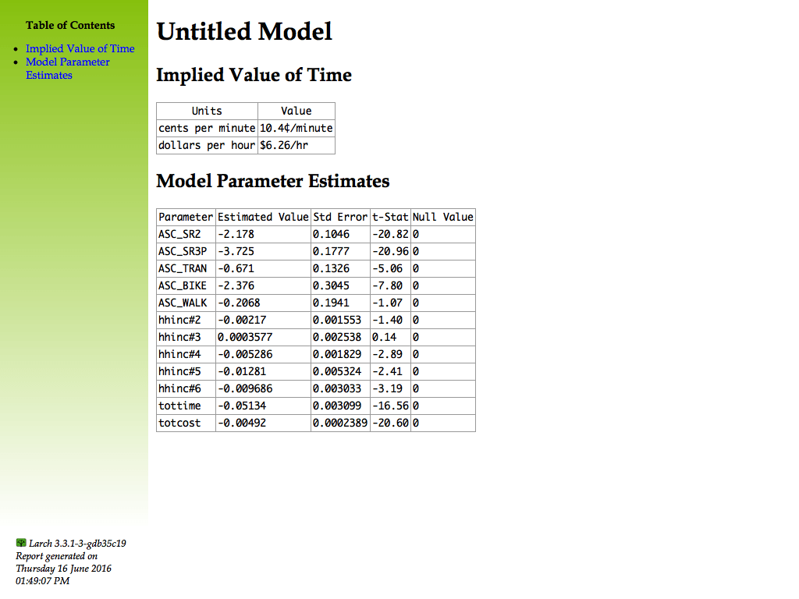

.. currentmodule:: larch

.. default-domain:: py

.. testsetup:: *

   import larch
   import os

========================
Reporting in HTML Format
========================

You can either use the pre-made :meth:`Model.xhtml_report` to generate a
report on a model, or you can roll your own using a combination of
xhtml_* components and custom elements.  For example, you might make a
custom table to hold some facts about your model or data:

.. doctest::
	:options: +ELLIPSIS, +NORMALIZE_WHITESPACE

	>>> from larch.util.xhtml import XML_Builder
	>>> def report_valueoftime(m):
	...		from larch.roles import P
	...		VoT_cents_per_minute = P.tottime / P.totcost
	...		VoT_dollars_per_hour = (P.tottime * 60) / (P.totcost * 100)
	...		x = XML_Builder("div", {'class':"value_of_time"})
	...		x.h2("Implied Value of Time", anchor=1)
	...		with x.block("table"):
	...			with x.block("tr"):
	...				x.th("Units")
	...				x.th("Value")
	...			with x.block("tr"):
	...				x.td("cents per minute")
	...				x.td(VoT_cents_per_minute.strf(m, fmt="{:.1f}\xa2/minute"))
	...			with x.block("tr"):
	...				x.td("dollars per hour")
	...				x.td(VoT_dollars_per_hour.strf(m, fmt="${:.2f}/hr"))
	...		return x.close()

You can attach that function to a model using :meth:`Model.new_xhtml_section` like this:

.. doctest::
	:options: +ELLIPSIS, +NORMALIZE_WHITESPACE

	>>> m = larch.Model.Example(1, pre=True)
	>>> m.new_xhtml_section(lambda: report_valueoftime(m), 'valueoftime')

Now the report section is available under the name 'valueoftime', so you can include it in a
:meth:`Model.xhtml` report, obtaining either a xhtml section or a fully built html file:

.. doctest::
	:options: +ELLIPSIS, +NORMALIZE_WHITESPACE

	>>> m.xhtml( 'title', 'params', 'valueoftime' )
	<larch.util.xhtml.Elem 'div' at ...>
	>>> m.xhtml( 'title', 'params', 'valueoftime', return_html=True )
	b'<!DOCTYPE html PUBLIC "-//W3C//DTD XHTML 1.0 Transitional//EN" "http://www.w3.org/TR/xhtml1/DTD/xhtml1-transitional.dtd"><html xmlns="http://www.w3.org/1999/xhtml"><head>...</head><body>...</body></html>'

Or, using a more complex but lower level python code, you could incorporate that table into a model report like this:

.. doctest::
	:options: +ELLIPSIS, +NORMALIZE_WHITESPACE

	>>> from larch.util.xhtml import XHTML
	>>> m = larch.Model.Example(1, pre=True)
	>>> with XHTML(quickhead=m) as f:
	...		f.append( m.xhtml_title() )
	...		f.append( report_valueoftime(m) )
	...		f.append( m.xhtml_params() )
	...		print(f.dump())
	...
	b'<!DOCTYPE html PUBLIC "-//W3C//DTD XHTML 1.0 Transitional//EN" "http://www.w3.org/TR/xhtml1/DTD/xhtml1-transitional.dtd"><html xmlns="http://www.w3.org/1999/xhtml"><head>...</html>'

Instead of printing to the console, you can send it to a file and open in your favorite browser.
Then it might look like this:

There are a variety of xhtml components that can be used in roll your own report writing:

.. automethod:: Model.xhtml_report

.. automethod:: Model.xhtml_title

.. automethod:: Model.xhtml_params

.. automethod:: Model.xhtml_ll

.. automethod:: Model.xhtml_data

.. automethod:: Model.xhtml_utilitydata

